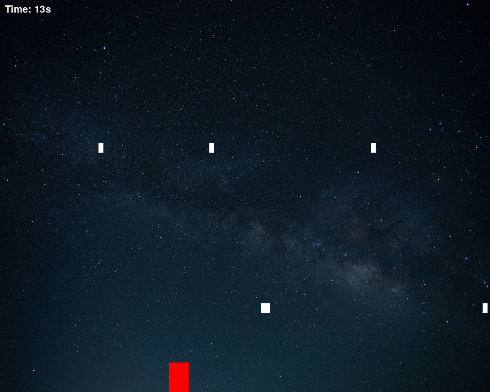
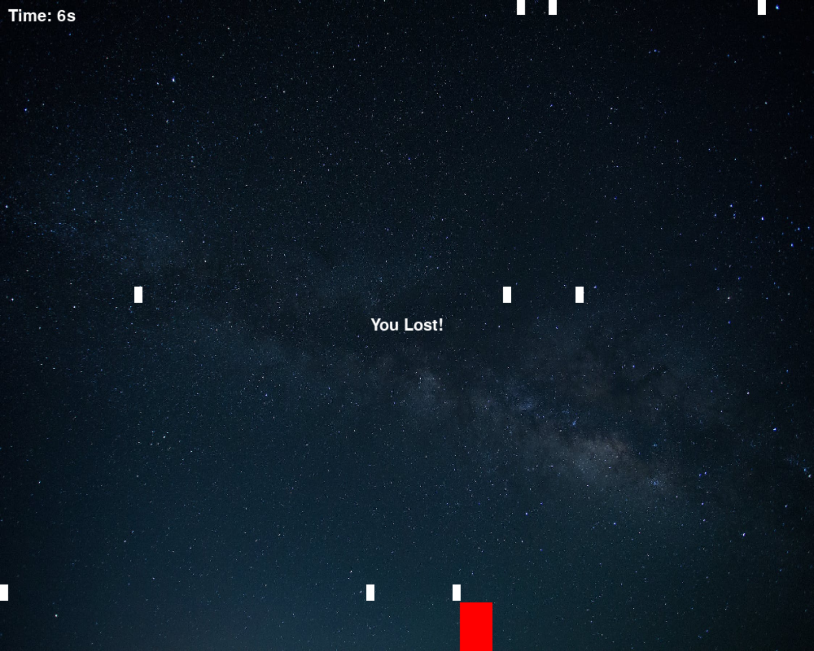

# 🕹 Python Game Development Project

This project walks through creating a small game in Python — using basic language features and game logic — helping you practice fundamental programming and interactive gameplay mechanics.

---

## 🎯 Project Overview

This game demonstrates:

- How to set up a Python game environment 🧰  
- Basic game loop and logic 🔁  
- Handling user input 🎮  
- Drawing and updating graphics 🖼  
- Simple collision and win/lose conditions ⚔️  
- Using Python’s built‑in features for interactive applications 🐍  

---

## 📚 Things Learned

- Fundamental **Python programming concepts**  
- Creating games using Python  
- Implementing **game loops** and rendering visuals  
- **Event handling** for user interactions  
- Structuring game logic and states  
- Debugging and testing interactive code

---

## 🖼 Screenshots

**Game Window 1:**  
  

**Game Window 1:** 
 

---

## 📜 Credits

- **Video Credits:** [How to Make a Game in Python by Tech With Tim](https://www.youtube.com/watch?v=waY3LfJhQLY)  
- **README file:** Done with the help of ChatGPT 🤖

